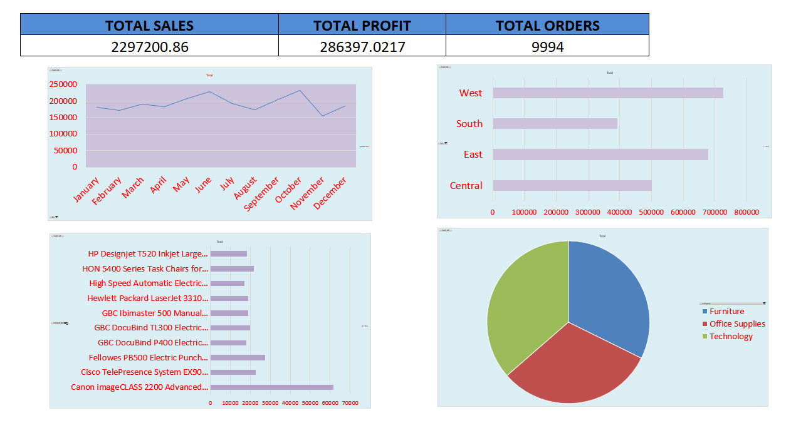

# 📊 FUTURE_DS_01 – Data Analysis Project

## 📌 Overview
This project focuses on analyzing a dataset using Excel to extract meaningful insights and present them through clear visualizations. It demonstrates core data analysis skills such as data cleaning, interpretation, and dashboard creation.

---

## 🎯 Objective
- To analyze raw data and convert it into actionable insights  
- To create visual representations for better decision-making  
- To showcase Excel-based data analysis skills  

---

## 📂 Project Files
FUTURE_DS_01/
│── FUTURE_DS_01.xlsx   # Dataset and analysis
│── FUTURE_DS_01.jpg    # Visualization / dashboard output
│── README.md           # Project documentation

---

## 🛠️ Tools & Technologies
- Microsoft Excel  
  - Data Cleaning  
  - Pivot Tables  
  - Charts & Graphs  
  - Dashboard Creation  

---

## 🔍 Key Steps Performed
1. Data Cleaning  
   - Removed duplicates  
   - Handled missing values  

2. Data Analysis  
   - Used pivot tables for summarization  
   - Applied formulas for insights  

3. Data Visualization  
   - Created charts and graphs  
   - Designed a simple dashboard  

---

## 📈 Insights
- Identified key trends in the dataset  
- Highlighted top-performing categories  
- Observed patterns useful for decision-making  

---

## 🖼️ Output Preview

---

## 💡 Skills Demonstrated
- Data Analysis  
- Excel Proficiency  
- Data Visualization  
- Analytical Thinking  

---

## 🚀 Future Improvements
- Convert this project into Python (Pandas + Matplotlib)  
- Build an interactive dashboard using Power BI / Tableau  
- Add more advanced analytics  

---

## 👤 Author
**Vinayak Ojha**  
Aspiring Data Analyst | Passionate about data-driven decision making  

---

## ⭐ Why This Project Matters
This project reflects the ability to:
- Work with real-world data  
- Extract insights  
- Present findings clearly  
